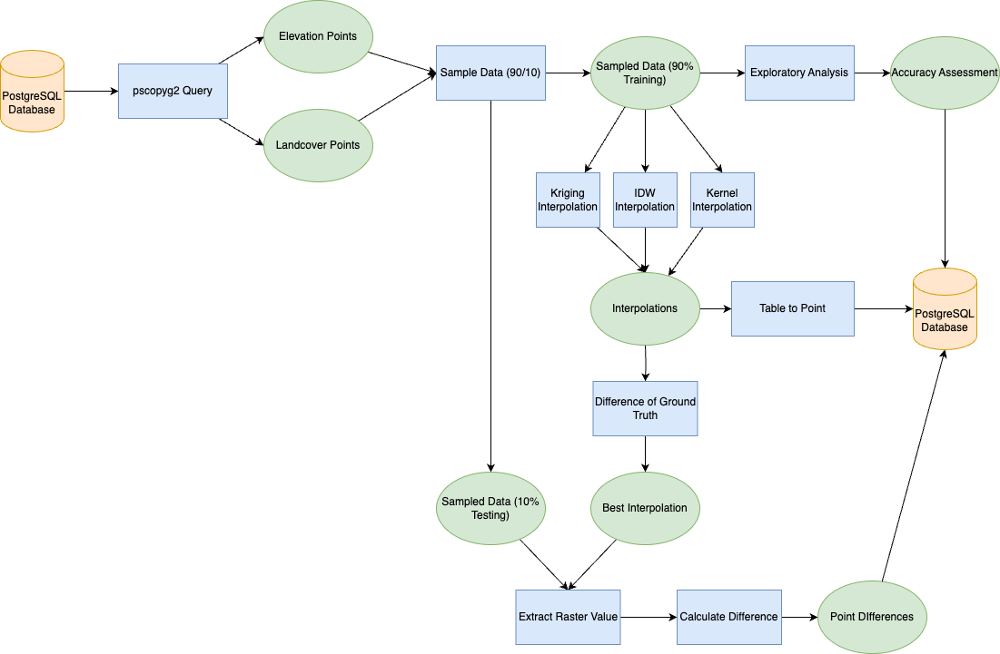
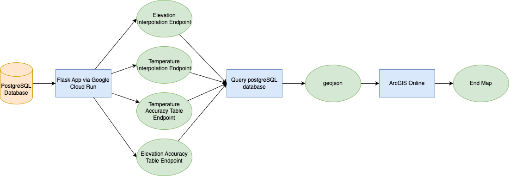

 # Lab 3

This repository contains code for an interpolation project that involves pulling elevation and temperature point data from a database, sampling data from both datasets, performing exploratory interpolation, applying IDW (Inverse Distance Weighting), Kriging, and Kernel interpolation methods, and pushing the results back to the database. Additionally, it includes code for performing accuracy assessment using the Kriging data. The project is then deployed to Google Cloud Run, allowing access through an API link.

## Overview

This project aims to interpolate elevation and temperature data to provide spatial estimates across a geographic area. The interpolation methods used include IDW, Kriging, and Kernel interpolation. Accuracy assessment is conducted to evaluate the performance of the Kriging method.

## Features

- Pulls elevation and temperature point data from a database
- Samples data from both datasets. Gets training and testing point data.
- Performs exploratory interpolation
- Applies IDW, Kriging, and Kernel interpolation methods
- Pushes the interpolated results as point data back to the database
- Conducts accuracy assessment using the Kriging data
- Deploys the project to Google Cloud Run for accessibility through an API link on ArcGIS Online

## Requirements

- Python
- ArcGIS Pro or Jupyter Notebooks
- Google Cloud Platform account
- Database access credentials
- Flask
- psycopg2

